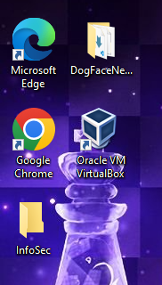
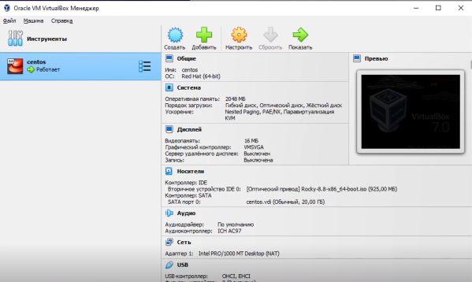
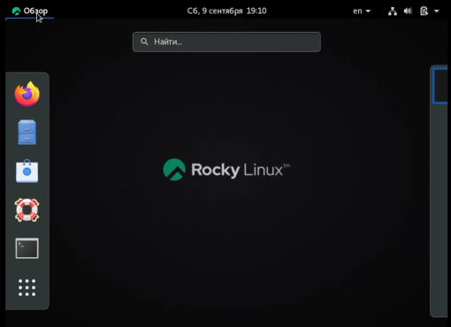
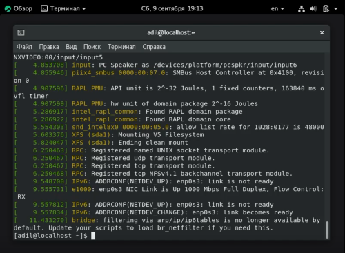
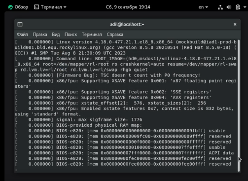

---
# Front matter
title: "Отчет по лабораторной работе №1. Установка и конфигурация операционной системы на виртуальную машину."
author: "Мухамедияр Адиль, НКНбд-01-20"

# Formatting
toc: false
slide_level: 2
header-includes: 
 - \metroset{progressbar=frametitle,sectionpage=progressbar,numbering=fraction}
 - '\makeatletter'
 - '\beamer@ignorenonframefalse'
 - '\makeatother'
aspectratio: 43
section-titles: true
theme: metropolis
---

# Цель выполнения лабораторной работы 

Приобретение практических навыков по установке операционных систем на виртуальные машины, а также навыков по настройке.

## Результат выполнения лабораторной работы

# Контрольные вопросы

1. Какую информацию содержит учётная запись пользователя?
2. Укажите команды терминала и приведите примеры:
– для получения справки по команде;
– для перемещения по файловой системе;
– для просмотра содержимого каталога;
– для определения объёма каталога;
– для создания / удаления каталогов / файлов;
– для задания определённых прав на файл / каталог;
– для просмотра истории команд.
3. Что такое файловая система? Приведите примеры с краткой характери-
стикой.
4. Как посмотреть, какие файловые системы подмонтированы в ОС?
5. Как удалить зависший процесс?

# Выводы по лабораторной работе

Получены навыки создания виртуальных машин, и установки ОС на них.