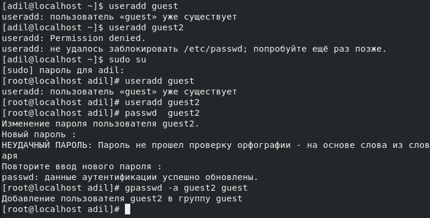
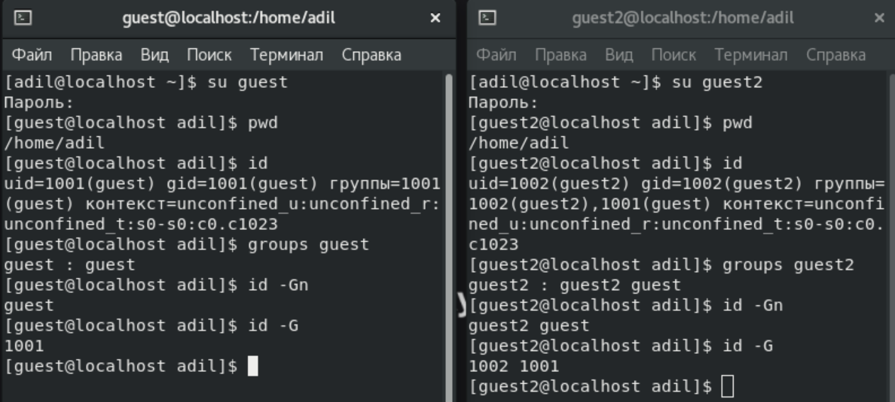
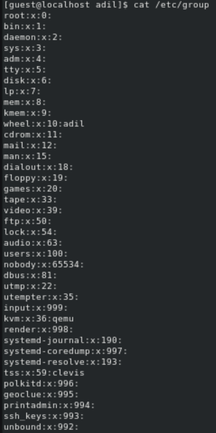
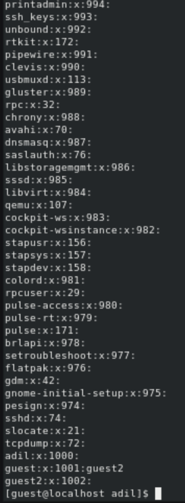
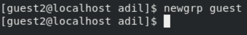
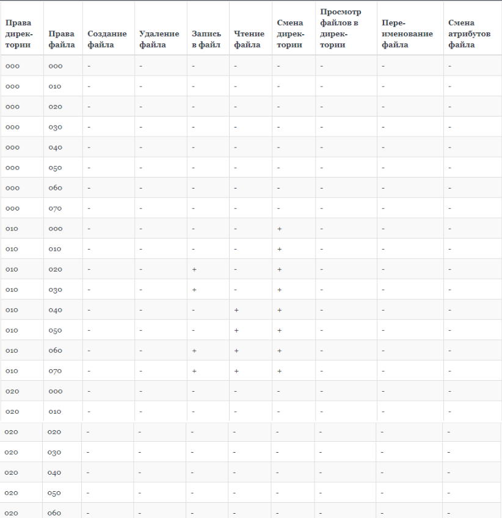
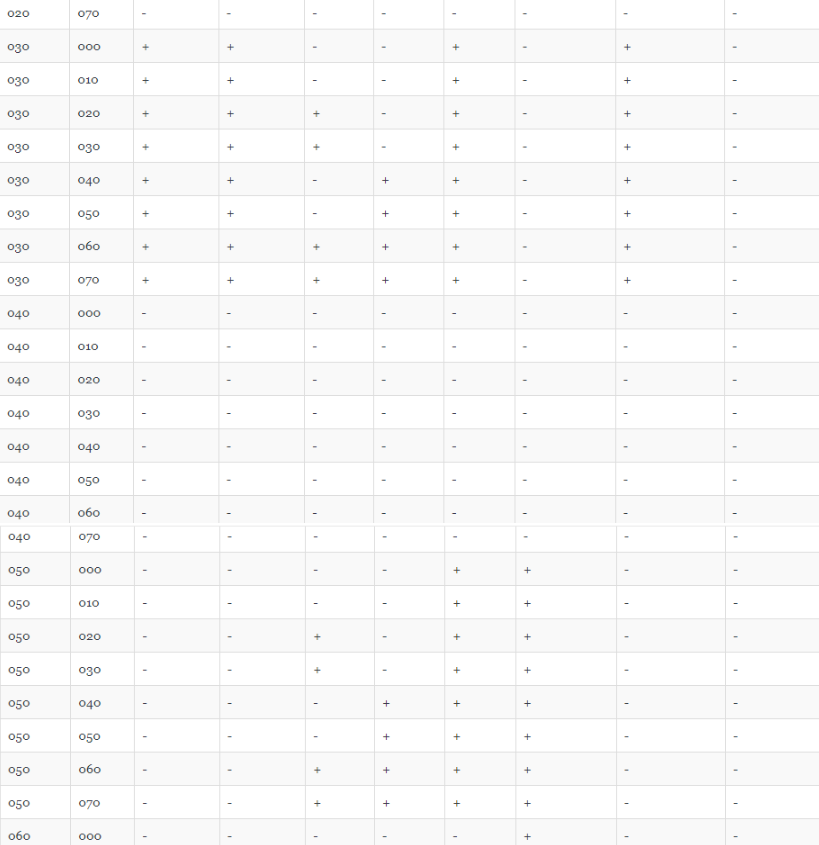
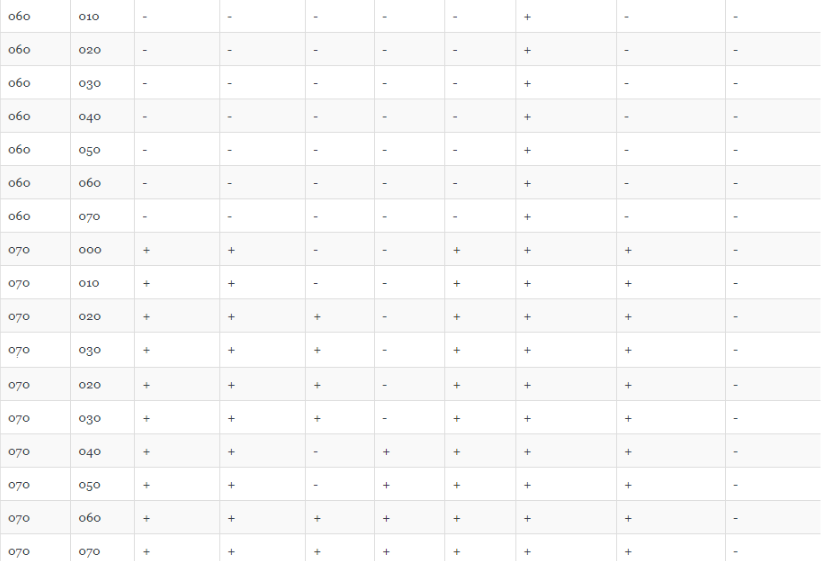

---
# Front matter
title: "Лабораторная работа № 3. Дискреционное разграничение прав в Linux. Два пользователя."
author: "Сироджиддинов Камолиддин, НКНбд-01-21"

## Generic otions
lang: ru-RU
toc-title: "Содержание"

## Bibliography
bibliography: bib/cite.bib
csl: pandoc/csl/gost-r-7-0-5-2008-numeric.csl

## Pdf output format
toc: true # Table of contents
toc-depth: 2
lof: true # List of figures
lot: true # List of tables
fontsize: 12pt
linestretch: 1.5
papersize: a4
documentclass: scrreprt
## I18n polyglossia
polyglossia-lang:
  name: russian
  options:
	- spelling=modern
	- babelshorthands=true
polyglossia-otherlangs:
  name: english
## I18n babel
babel-lang: russian
babel-otherlangs: english
## Fonts
mainfont: PT Serif
romanfont: PT Serif
sansfont: PT Sans
monofont: PT Mono
mainfontoptions: Ligatures=TeX
romanfontoptions: Ligatures=TeX
sansfontoptions: Ligatures=TeX,Scale=MatchLowercase
monofontoptions: Scale=MatchLowercase,Scale=0.9
## Biblatex
biblatex: true
biblio-style: "gost-numeric"
biblatexoptions:
  - parentracker=true
  - backend=biber
  - hyperref=auto
  - language=auto
  - autolang=other*
  - citestyle=gost-numeric
## Pandoc-crossref LaTeX customization
figureTitle: "Рис."
tableTitle: "Таблица"
listingTitle: "Листинг"
lofTitle: "Список иллюстраций"
lotTitle: "Список таблиц"
lolTitle: "Листинги"
## Misc options
indent: true
header-includes:
  - \usepackage{indentfirst}
  - \usepackage{float} # keep figures where there are in the text
  - \floatplacement{figure}{H} # keep figures where there are in the text
---

# Цель работы

Получение практических навыков работы в консоли с атрибутами файлов для групп пользователей.

# Задание

Выполнить все пункты работы, занося ответы на поставленные вопросы и замечания в отчёт.

# Ход работы

1. Для начало я решил перейти в режим `sudo`, что в свою очередь обеспечивает нас нужными правами для дальнейшей работы. Создал учетные записи `guest` и `guest2`. Следующим шагом добавил `guest2` в группу `guest`.

2. Был осуществел вход от двух пользователей на двух разных терминалах(окнах), получив информацию о группах, в которые они входят.

3. Было просмотрено содержимое `файла etc/group`. Заметим, что данные о группах совпадают с ранее полученными данными.

4. Был зарегестрирован пользователь `guest2` в группу `guest`.

5. Было дано всем пользователям группы все права доступа к директории `/home/guest`.

Исходя из полученной информации, была заполнена таблица.

# Выводы

Получил практические навыки работы в консоли с атрибутами файлов для групп пользователей.

# Библиография

1. Методические материалы курса.
